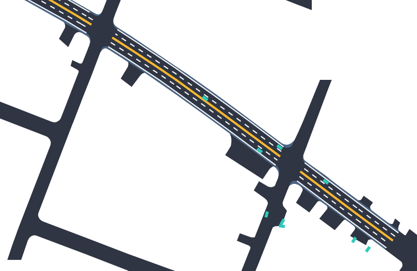
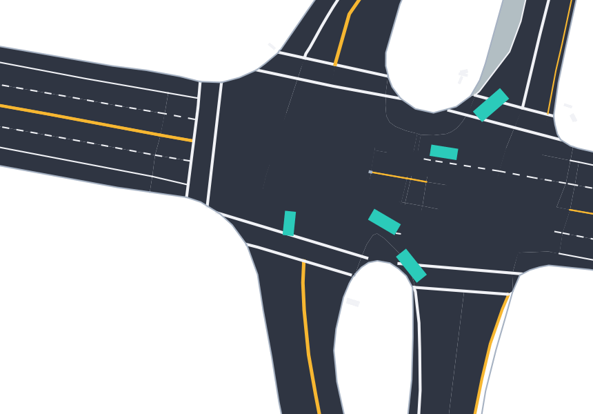
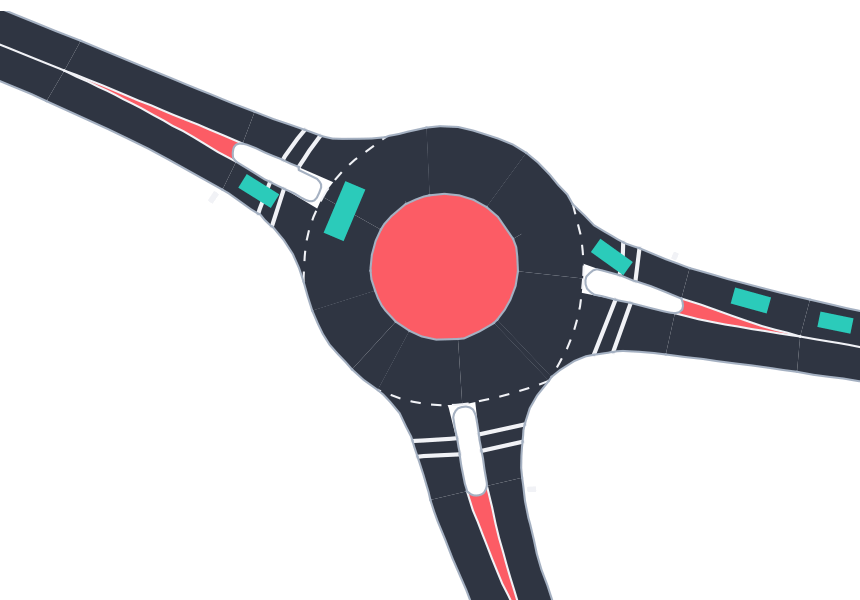

# Tactics2D: A Reinforcement Learning Environment Library for Driving Decision-making

[](https://app.codacy.com/gh/WoodOxen/tactics2d/dashboard?utm_source=gh&utm_medium=referral&utm_content=&utm_campaign=Badge_grade)
[](https://codecov.io/gh/WoodOxen/tactics2d)

[](https://tactics2d.readthedocs.io/en/latest/)

[](https://pypi.org/project/tactics2d/)
[](https://discordapp.com/widget?id=1209363816912126003&theme=system)


[](https://github.com/psf/black)
[](https://github.com/WoodOxen/tactics2d/blob/master/LICENSE)

[EN](README.md) | CN

## 关于

> [!note]
> 这个仓库为上海交通大学研究生课程AU7043提供了支持。
>
> **请各位同学切换到AU7043分支。使用`git clone`指令安装Tactics2D。在上课期间，仓库会实时更新！**

`tactics2d` 是一个开源的 Python 库，专为自动驾驶中的强化学习决策模型开发与评估提供多样且具有挑战性的交通场景。tactics2d 具备以下核心特性：

- **兼容性**
  - 📦 轨迹数据集：支持无缝导入多种真实世界轨迹数据集，包括 Argoverse、Dragon Lake Parking (DLP)、INTERACTION、LevelX 系列（HighD、InD、RounD、ExiD）、NuPlan 以及 Waymo Open Motion Dataset (WOMD)，涵盖轨迹解析和地图信息。
  - 📄 地图格式：支持解析和转换常用的开放地图格式，如 OpenDRIVE、Lanelet2 风格的 OpenStreetMap (OSM)，以及 SUMO roadnet。
- **可定制性**
  - 🚗 交通参与者：支持创建新的交通参与者类别，可自定义物理属性、动力学/运动学模型及行为模型。
  - 🚧 道路元素：支持定义新的道路元素，重点支持各类交通规则相关设置。
- **多样性**
  - 🛣️ 交通场景：内置大量遵循 `gym` 架构的交通场景仿真环境，包括高速公路、并线、无信号/有信号路口、环形交叉口、停车场以及赛车道等。
  - 🚲 交通参与者：提供多种内置交通参与者，具备真实的物理参数，详细说明可参考[此处](https://tactics2d.readthedocs.io/en/latest/api/participant/#templates-for-traffic-participants)。
  - 📷 传感器：提供鸟瞰图（BEV）语义分割 RGB 图像和单线激光雷达点云作为模型输入。
- **可视化**：提供用户友好的可视化工具，可实时渲染交通场景及参与者，并支持录制与回放交通过程。
- **可靠性**：超过 85% 的代码已被单元测试与集成测试覆盖，保障系统稳定性与可用性。

如需进一步了解 `tactics2d`，请参考我们的完整[文档](https://tactics2d.readthedocs.io/en/latest/)，并可在[这里](https://tactics2d.readthedocs.io/en/latest/#why-tactics2d)查看与其他同类库的详细对比。

## 社区

我们有一个 [Discord 社区](https://discordapp.com/widget?id=1209363816912126003&theme=system) 用于交流与支持，欢迎随时提问。你也可以通过 [Github Issues](https://github.com/WoodOxen/tactics2d/issues) 和 PR 参与讨论与贡献。

## 安装

### 0. 系统要求

我们在以下系统版本和Python版本上进行了测试：

> 说明：下表与 `test_modules` CI 工作流的覆盖版本保持一致。

| System | 3.8 | 3.9 | 3.10 | 3.11 | 3.12 | 3.13 |
| --- | --- | --- | --- | --- | --- | --- |
| Ubuntu 18.04 | :white_check_mark: | - | - | - | - | - |
| Ubuntu 20.04 | :white_check_mark: | :white_check_mark: | - | - | - | - |
| Ubuntu 22.04 | :white_check_mark: | :white_check_mark: | :white_check_mark: | :white_check_mark: | :white_check_mark: | :white_check_mark: |
| Ubuntu 24.04 | :white_check_mark: | :white_check_mark: | :white_check_mark: | :white_check_mark: | :white_check_mark: | :white_check_mark: |
| Windows | - | - | :white_check_mark: | :white_check_mark: | :white_check_mark: | :white_check_mark: |
| macOS | :white_check_mark: | :white_check_mark: | :white_check_mark: | :white_check_mark: | :white_check_mark: | :white_check_mark: |

### 1. 安装

我们强烈推荐使用 `conda` 管理 Python 环境。如果你尚未安装 `conda`，可从[这里](https://docs.conda.io/en/latest/miniconda.html)下载安装。

```bash
# 创建一个新的conda环境
conda create -n tactics2d python=3.9
conda activate tactics2d
```

#### 1.1 通过 PyPI 安装

如果你只是想使用稳定版本，可以通过 `pip` 安装：

```bash
pip install tactics2d
```

#### 1.2 通过源码安装

你也可以从 GitHub 源码安装 `tactics2d`。如果你想运行示例代码或参与开发，推荐使用这种方式。请注意，在安装前需要确保系统已安装 GCC。

```bash
# 克隆仓库时会递归子模块，但会跳过大文件（主要是 NuPlan 的地图数据）
# 请从 NuPlan 官网下载地图数据，并放置到 `tactics2d/data/map/NuPlan` 目录
git clone --recurse-submodules git@github.com:WoodOxen/tactics2d.git
cd tactics2d
pip install -v .
```

如果没有报错，即表示 `tactics2d` 已安装成功。

### 2. 准备数据集

根据各轨迹数据集的许可协议，我们无法随 `tactics2d` 一起分发原始数据。你需要从各自官网下载相应数据集。目前 `tactics2d` 支持以下数据集：

- [Argoverse 2](https://www.argoverse.org/av2.html)
- [Dragon Lake Parking (DLP)](https://sites.google.com/berkeley.edu/dlp-dataset)
- [HighD](https://www.highd-dataset.com/)
- [InD](https://www.ind-dataset.com/)
- [RounD](https://www.round-dataset.com/)
- [ExiD](https://www.exid-dataset.com/)
- [INTERACTION](http://interaction-dataset.com/)
- [NuPlan](https://www.nuscenes.org/nuplan)
- [Waymo Open Motion Dataset v1.2 (WOMD)](https://waymo.com/open/about/)

对于HighD, InD, RounD, ExiD, INTERACTION，如果申请数据集所需时间过长，可以考虑加入QQ群互帮互助。

你可以将数据集放在任意位置，然后通过软链接的方式将数据集链接到`tactics2d`的数据目录下，或者修改数据集解析函数的路径。

安装完成后，你可以运行 [tutorial jupyter notebooks](docs/tutorial) 来快速上手 `tactics2d`。

如果要运行 [train_parking_demo.ipynb](docs/tutorial/train_parking_demo.ipynb)（这是我们在这篇 [paper](https://github.com/jiamiya/HOPE) 中工作的简化版本），你需要额外拉取 `rllib` 子模块：

```bash
git submodule update --init --recursive
```

### 4. 更多示例

我们已为 `tactics2d` 构建完整 CI 流程，[tests](tests) 目录下的样例可用于快速了解接口用法。你可以使用以下命令运行指定样例：

```bash
pip install pytest
pytest tests/[test_file_name]::[test_function_name]
```

## Demo

`tactics2d` 支持解析多种真实世界轨迹数据集，包括 Argoverse、Dragon Lake Parking (DLP)、INTERACTION、LevelX 系列（highD、inD、rounD、ExiD）、NuPlan 以及 Waymo Open Motion Dataset (WOMD)。更多演示请参考[文档](https://tactics2d.readthedocs.io/en/latest/dataset-support/)。

### 高速场景

<table>
  <tr>
    <th>HighD (Location 3)</th>
    <th>ExiD (Location 6)</th>
  </tr>
  <tr>
    <td valign="top" width="50%">
    
    </td>
    <td valign="top" width="50%">
    
    </td>
  </tr>
</table>

### 路口场景

<table>
  <tr>
    <th>InD (Location 4)</th>
    <th>Argoverse</th>
  </tr>
  <tr>
    <td valign="top" width="50%">
    
    </td>
    <td valign="top" width="50%">
    
    </td>
  </tr>
</table>

<table>
  <tr>
    <th>INTERACTION</th>
    <th>WOMD</th>
  </tr>
  <tr>
    <td valign="top" width="50%">
    
    </td>
    <td valign="top" width="50%">
    
    </td>
  </tr>
</table>

### 环岛场景

<table>
  <tr>
    <th>RounD (Location 0)</th>
    <th>INTERACTION</th>
  </tr>
  <tr>
    <td valign="top" width="50%">
    
    </td>
    <td valign="top" width="50%">
    
    </td>
  </tr>
</table>

### 泊车场景

<table>
  <tr>
    <th>DLP</th>
    <th>Self-generated</th>
  </tr>
  <tr>
    <td valign="top" width="70%">
    
    </td>
    <td valign="top" width="20%">
    <p><em>Coming soon</em></p>
    </td>
  </tr>
</table>

### 赛车场景

## 引用

如果`tactics2d`对你的研究有所帮助，请在你的论文中引用我们。

```bibtex
@article{li2024tactics2d,
  title={Tactics2D: A Highly Modular and Extensible Simulator for Driving Decision-Making},
  author={Li, Yueyuan and Zhang, Songan and Jiang, Mingyang and Chen, Xingyuan and Yang, Jing and Qian, Yeqiang and Wang, Chunxiang and Yang, Ming},
  journal={IEEE Transactions on Intelligent Vehicles},
  year={2024},
  publisher={IEEE}
}
```

## 基于`tactics2d`的工作

欢迎大家提交 Pull Request，更新基于`tactics2d`的工作。

Jiang, Mingyang\*, Li, Yueyuan\*, Zhang, Songan, et al. "[HOPE: A Reinforcement Learning-based Hybrid Policy Path Planner for Diverse Parking Scenarios](https://arxiv.org/abs/2405.20579)." *IEEE Transactions on Intelligent Transportation Systems* (2025). (\*Co-first author) | [Code](https://github.com/jiamiya/HOPE) | [Demo](https://www.youtube.com/watch?v=62w9qhjIuRI)
