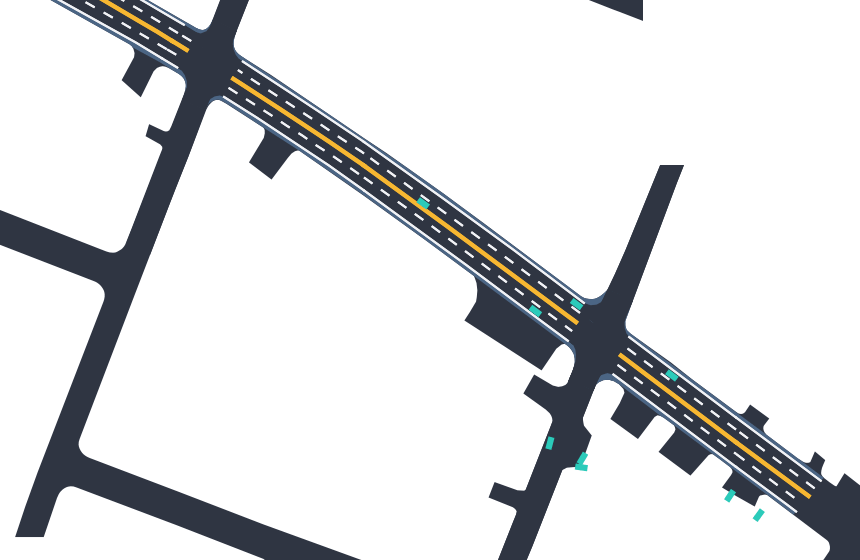
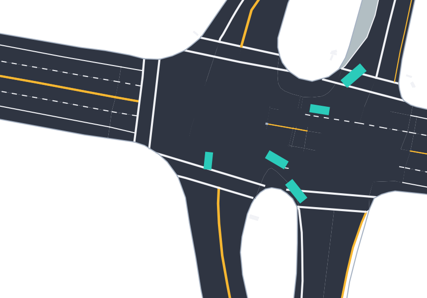
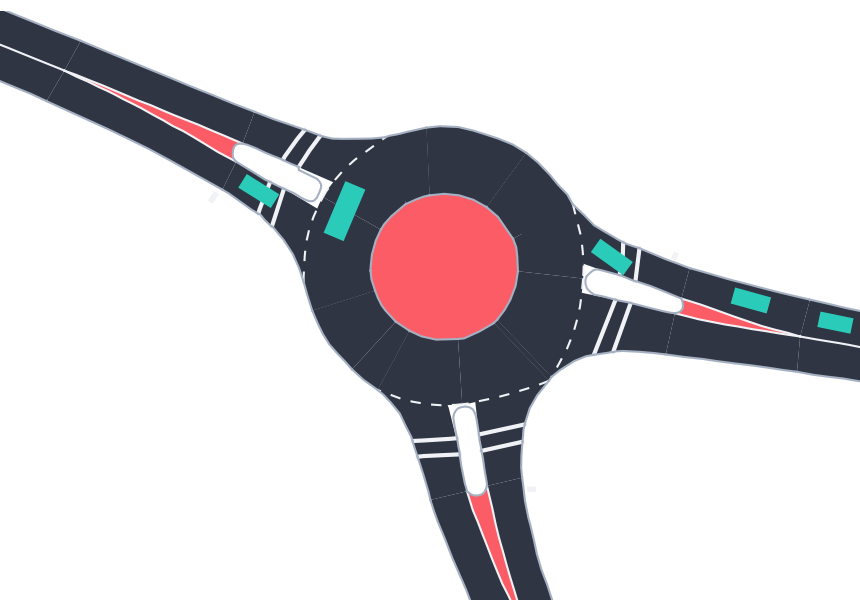

# Tactics2D: A Reinforcement Learning Environment Library with Generative Scenarios for Driving Decision-making

[](https://app.codacy.com/gh/WoodOxen/tactics2d/dashboard?utm_source=gh&utm_medium=referral&utm_content=&utm_campaign=Badge_grade)
[](https://codecov.io/gh/WoodOxen/tactics2d)

[](https://tactics2d.readthedocs.io/en/latest/)

[](https://pypi.org/project/tactics2d/)
[](https://discordapp.com/widget?id=1209363816912126003&theme=system)


[](https://github.com/psf/black)
[](https://github.com/WoodOxen/tactics2d/blob/dev/LICENSE)

[EN](README.md) | CN

## 关于

> [!note]
> 这个仓库为上海交通大学研究生课程AU7043提供了支持。
>
> **请各位同学切换到AU7043分支。使用`git clone`指令安装Tactics2D。在课程期间，仓库会实时更新！**

`tactics2d` 是一个开源的 Python 库，专为自动驾驶中的强化学习决策模型开发与评估提供多样且具有挑战性的交通场景。tactics2d 具备以下核心特性：

- **兼容性**
  - 📦 轨迹数据集：支持无缝导入多种真实世界的轨迹数据集，包括 Argoverse、Dragon Lake Parking (DLP)、INTERACTION、LevelX 系列（HighD、InD、RounD、ExiD）、NuPlan 以及 Waymo Open Motion Dataset (WOMD)，涵盖轨迹解析和地图信息。*欢迎大家通过Issue提出对其他数据集的解析需求*。
  - 📄 地图格式：支持解析和转换常用的开放地图格式，如 OpenDRIVE、Lanelet2 风格的 OpenStreetMap (OSM)，以及 SUMO roadnet。
- **可定制性**
  - 🚗 交通参与者：支持创建新的交通参与者类别，可自定义物理属性、动力学/运动学模型及行为模型。
  - 🚧 道路元素：支持定义新的道路元素，重点支持各类交通规则相关设置。
- **多样性**
  - 🛣️ 交通场景：内置大量遵循 `gym` 架构的交通场景仿真环境，包括高速公路、并线、无信号/有信号路口、环形交叉口、停车场以及赛车道等。
  - 🚲 交通参与者：提供多种内置交通参与者，具备真实的物理参数，详细说明可参考[此处](https://tactics2d.readthedocs.io/en/latest/api/participant/#templates-for-traffic-participants)。
  - 📷 传感器：提供鸟瞰图（BEV）语义分割 RGB 图像和单线激光雷达点云作为模型输入。
- **可视化**：提供用户友好的可视化工具，可实时渲染交通场景及参与者，并支持录制与回放交通过程。
- **可靠性**：超过 85% 的代码已被单元测试与集成测试覆盖，保障系统稳定性与可用性。

如需了解 `tactics2d` 的更多信息，请参考[文档](https://tactics2d.readthedocs.io/en/latest/)。

## 社区与支持

- [Discord 频道](https://discord.gg/bJ5yHT3bcd)
- [Github Issues](https://github.com/WoodOxen/tactics2d/issues)
- QQ群：929488317

## 安装

### 0. 系统要求

我们在以下系统版本和Python版本上进行了测试：

| System | 3.8 | 3.9 | 3.10 | 3.11 |
| --- | --- | --- | --- | --- |
| Ubuntu 18.04 | :white_check_mark: | - | - | - |
| Ubuntu 20.04 | :white_check_mark: | :white_check_mark: | :white_check_mark: | :white_check_mark: |
| Ubuntu 22.04 | :white_check_mark: | :white_check_mark: | :white_check_mark: | :white_check_mark: |
| Windows | :white_check_mark: | :white_check_mark: | :white_check_mark: | :white_check_mark: |
| MacOS | :white_check_mark: | :white_check_mark: | :white_check_mark: | :white_check_mark: |

### 1. 安装

强烈推荐大家使用环境管理工具 `conda` 或 `virtualenv` 来创建独立的 Python 环境，以避免依赖冲突。如果你还没有安装 `conda`，请参考[官方文档](https://docs.conda.io/projects/conda/en/latest/user-guide/install/index.html)进行安装。

```bash
# 创建一个新的conda环境
conda create -n tactics2d python=3.9
conda activate tactics2d
```

#### 1.1 通过 PyPI 安装

如果你只是想使用稳定版本，可以通过 `pip` 安装：

```bash
pip install tactics2d
```

#### 1.2 通过源码安装

如果你想要尝试最新的功能，可以通过源码安装。自从 v0.1.7之后，你需要先安装GCC才能编译：

```bash
# 路径中不包含数据集，请根据需要自行下载并建立软链接
git clone --recurse-submodules git@github.com:WoodOxen/tactics2d.git
cd tactics2d
pip install -v .
```

### 2. 准备数据集

根据开源协议，`tactics2d`不会分发任何数据集。你可以通过以下方式获取数据集：

- [Argoverse 2](https://www.argoverse.org/av2.html)
- [Dragon Lake Parking (DLP)](https://sites.google.com/berkeley.edu/dlp-dataset)
- [HighD](https://www.highd-dataset.com/)
- [InD](https://www.ind-dataset.com/)
- [RounD](https://www.round-dataset.com/)
- [ExiD](https://www.exid-dataset.com/)
- [INTERACTION](http://interaction-dataset.com/)
- [NuPlan](https://www.nuscenes.org/nuplan)
- [Waymo Open Motion Dataset v1.2 (WOMD)](https://waymo.com/open/about/)

对于HighD, InD, RounD, ExiD, INTERACTION，如果申请数据集所需时间过长，可以考虑加入QQ群互帮互助。

你可以将数据集放在任意位置，然后通过软链接的方式将数据集链接到`tactics2d`的数据目录下，或者修改数据集解析函数的路径。

### 3. 运行示例

安装好`tactics2d`后，你可以运行[样例代码](docs/tutorials)。

其中，[train_parking_demo.ipynb](docs/tutorial/train_parking_demo.ipynb)是[HOPE](https://github.com/jiamiya/HOPE)的简化版本，为了成功运行这一示例，你需要安装`torch`和`torchvision`，并拉取子模块`rllib`。

```bash
git submodule update --init --recursive
```

### 4. 更多示例

我们为`tactics2d`搭建了一套完整的集成测试流程，其中的测试代码可以作为函数接口用法的参考。你可以在[这里](tests)找到这些测试代码。运行测试代码的方法如下：

```bash
pip install pytest
pytest tests/[test_file_name]::[test_function_name]
```

## 可视化展示

### 高速场景

<table>
  <tr>
    <th>HighD (Location 3)</th>
    <th>ExiD (Location 6)</th>
  </tr>
  <tr>
    <td valign="top" width="50%">
    
    </td>
    <td valign="top" width="50%">
    
    </td>
  </tr>
</table>

### 路口场景

<table>
  <tr>
    <th>InD (Location 4)</th>
    <th>Argoverse</th>
  </tr>
  <tr>
    <td valign="top" width="50%">
    
    </td>
    <td valign="top" width="50%">
    
    </td>
  </tr>
</table>

<table>
  <tr>
    <th>INTERACTION</th>
    <th>WOMD</th>
  </tr>
  <tr>
    <td valign="top" width="50%">
    
    </td>
    <td valign="top" width="50%">
    
    </td>
  </tr>
</table>

### 环岛场景

<table>
  <tr>
    <th>RounD (Location 0)</th>
    <th>INTERACTION</th>
  </tr>
  <tr>
    <td valign="top" width="50%">
    
    </td>
    <td valign="top" width="50%">
    
    </td>
  </tr>
</table>

### 泊车场景

<table>
  <tr>
    <th>DLP</th>
    <th>Self-generated</th>
  </tr>
  <tr>
    <td valign="top" width="70%">
    
    </td>
    <td valign="top" width="20%">
    
    </td>
  </tr>
</table>

### 赛车场景

## 引用

如果`tactics2d`对你的研究有所帮助，请在你的论文中引用我们。

```bibtex
@article{li2024tactics2d,
  title={Tactics2D: A Highly Modular and Extensible Simulator for Driving Decision-Making},
  author={Li, Yueyuan and Zhang, Songan and Jiang, Mingyang and Chen, Xingyuan and Yang, Jing and Qian, Yeqiang and Wang, Chunxiang and Yang, Ming},
  journal={IEEE Transactions on Intelligent Vehicles},
  year={2024},
  publisher={IEEE}
}
```

## 基于`tactics2d`的工作

欢迎大家提交 Pull Request，更新基于`tactics2d`的工作。

Jiang, Mingyang\*, Li, Yueyuan\*, Zhang, Songan, et al. "[HOPE: A Reinforcement Learning-based Hybrid Policy Path Planner for Diverse Parking Scenarios](https://arxiv.org/abs/2405.20579)." *IEEE Transactions on Intelligent Transportation Systems* (2025). (\*Co-first author) | [Code](https://github.com/jiamiya/HOPE) | [Demo](https://www.youtube.com/watch?v=62w9qhjIuRI)
