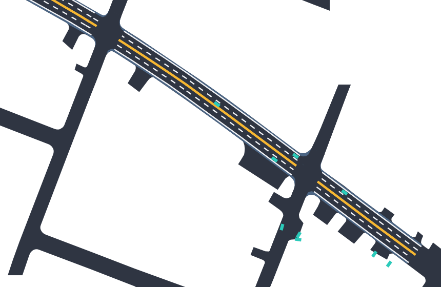
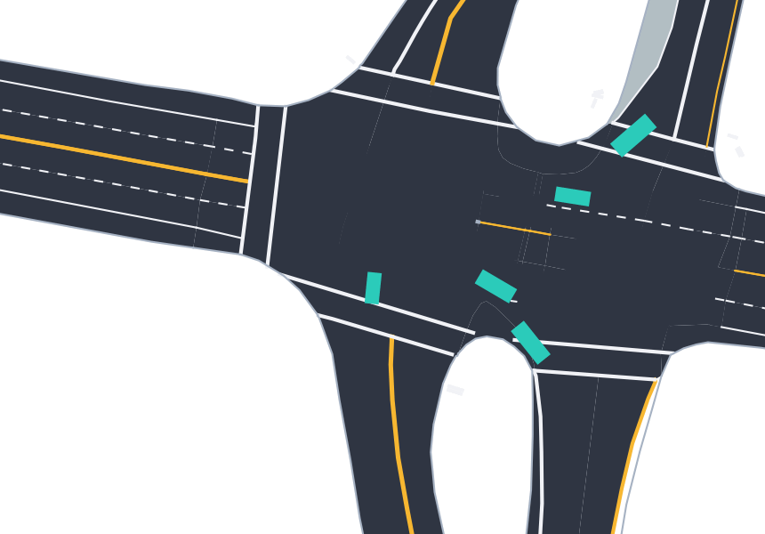
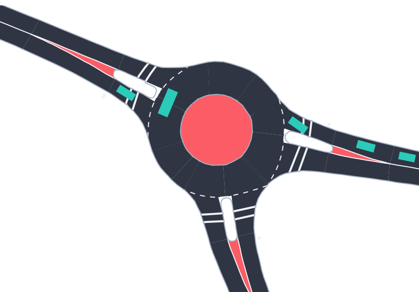

# Tactics2D: A Reinforcement Learning Environment Library for Driving Decision-making

[](https://app.codacy.com/gh/WoodOxen/tactics2d/dashboard?utm_source=gh&utm_medium=referral&utm_content=&utm_campaign=Badge_grade)
[](https://codecov.io/gh/WoodOxen/tactics2d)

[](https://tactics2d.readthedocs.io/en/latest/)

[](https://pypi.org/project/tactics2d/)
[](https://discordapp.com/widget?id=1209363816912126003&theme=system)


[](https://github.com/psf/black)
[](https://github.com/WoodOxen/tactics2d/blob/dev/LICENSE)

EN | [CN](README.CN.md)

> [!note]
> This is the official codebase for Course AU7043 in Shanghai Jiao Tong University.
> **For those who are taking this course, please download this repository by `git pull` command!**

## About

`tactics2d` is an open-source Python library that provides diverse and challenging traffic scenarios for the development and evaluation of reinforcement learning-based decision-making models in autonomous driving. `tactics2d` stands out with the following key features:

- **Compatibility**
  - 📦 Trajectory dataset -- Enables seamless importation of various real-world trajectory datasets, including Argoverse, Dragon Lake Parking (DLP), INTERACTION, LevelX Series (HighD, InD, RounD, ExiD), NuPlan, and Waymo Open Motion Dataset (WOMD), encompassing both trajectory parsing and map information.
  - 📄 Map format -- Enables parsing and conversion of commonly used open map formats like OpenDRIVE, Lanelet2-style OpenStreetMap (OSM), and SUMO roadnet.
- **Customizability**
  - 🚗 Traffic participants -- Supports the creation of new traffic participant classes with customizable physical attributes, physics dynamics/kinematics models, and behavior models.
  - 🚧 Road elements -- Support the definition of new road elements, with a focus on regulatory aspects.
- **Diversity**
  - 🛣️ Traffic scenarios -- Features an extensive range of built-in Gym-style traffic scenarios, including highway, lane-merging, unsignalized/signalized intersection, roundabout, parking, and racing.
  - 🚲 Traffic participants -- Features a variety of built-in traffic participants with realistic physics parameters, detailed further [here](https://tactics2d.readthedocs.io/en/latest/api/participant/#templates-for-traffic-participants).
  - 📷 Sensors -- Provides bird-eye-view (BEV) semantic segmentation RGB image and single-line LiDAR point cloud for model input.
- **Visualization** -- Offers a user-friendly visualization tool for real-time rendering of traffic scenarios and participants, along with the capability to record and replay traffic scenarios.
- **Reliability** -- Over 85\% code is covered by unit tests and integration tests.

For further information on `tactics2d`, please refer to our comprehensive [documentation](https://tactics2d.readthedocs.io/en/latest/), and a detailed comparison with other similar libraries is available [here](https://tactics2d.readthedocs.io/en/latest/#why-tactics2d).

## Community

We have a [Discord Community](https://discordapp.com/widget?id=1209363816912126003&theme=system) for support. Feel free to ask questions. Posting in [Github Issues](https://github.com/WoodOxen/tactics2d/issues) and PRs are also welcome.

## Installation

### 0. System Requirements

We have conducted testing for the execution and construction of `tactics2d` on the following platforms:

| System | 3.8 | 3.9 | 3.10 | 3.11 |
| --- | --- | --- | --- | --- |
| Ubuntu 18.04 | :white_check_mark: | - | - | - |
| Ubuntu 20.04 | :white_check_mark: | :white_check_mark: | :white_check_mark: | :white_check_mark: |
| Ubuntu 22.04 | :white_check_mark: | :white_check_mark: | :white_check_mark: | :white_check_mark: |
| Windows | :white_check_mark: | :white_check_mark: | :white_check_mark: | :white_check_mark: |
| MacOS | :white_check_mark: | :white_check_mark: | :white_check_mark: | :white_check_mark: |

### 1. Installation

We strongly recommend using `conda` to manage the Python environment. If you don't have `conda` installed, you can download it from [here](https://docs.conda.io/en/latest/miniconda.html).

```bash
# create a new conda environment
conda create -n tactics2d python=3.9
```

#### 1.1 Install from PyPI

You can simply install `tactics2d` from PyPI with the following command.

```bash
pip install tactics2d
```

#### 1.2 Install from Github

You can also install `tactics2d` from from its source on GitHub. This way is recommended if you want to run the sample code or contribute to the development of `tactics2d`. Please note that you should have GCC installed on your operating system before installing tactics2d.

```bash
# clone the repository with submodules but ignore the large files (mainly the NuPlan's map data)
# please download NuPlan's map data from its official website and put it in the `tactics2d/data/map/NuPlan` directory
git clone --recurse-submodules git@github.com:WoodOxen/tactics2d.git
cd tactics2d
pip install -v .
```

If no errors occurs, you should have installed `tactics2d` successfully.

### 2. Dataset Preparation

According to the licenses of the trajectory datasets, we cannot distribute the original datasets with `tactics2d`. You need to download the datasets from their official websites. Currently, `tactics2d` supports the following datasets:

- [Argoverse 2](https://www.argoverse.org/av2.html)
- [Dragon Lake Parking (DLP)](https://sites.google.com/berkeley.edu/dlp-dataset)
- [HighD](https://www.highd-dataset.com/)
- [InD](https://www.ind-dataset.com/)
- [RounD](https://www.round-dataset.com/)
- [ExiD](https://www.exid-dataset.com/)
- [INTERACTION](http://interaction-dataset.com/)
- [NuPlan](https://www.nuscenes.org/nuplan)
- [Waymo Open Motion Dataset v1.2 (WOMD)](https://waymo.com/open/about/)

You can put the downloaded files at whatever location you like. In the parser, you can specify the path to the dataset.

### 3. Run the Tutorial

After the installation, you can run the [tutorial jupyter notebooks](docs/tutorial) to get started with `tactics2d`.

To run [train_parking_demo.ipynb](docs/tutorial/train_parking_demo.ipynb), which is a simplified version of our work in this [paper](https://github.com/jiamiya/HOPE), you need to pull an extra module `rllib`:

```bash
git submodule update --init --recursive
```

### 4. For More Samples

We have built a complete CI pipeline for `tactics2d`. The samples under [tests](tests) are good samples for you to get familiar with the interfaces. To run the samples, you can use the following command:

```bash
pip install pytest
pytest tests/[test_file_name]::[test_function_name]
```

Please refers to the [documentation](https://tactics2d.readthedocs.io/en/latest/) for more information.

## Demo

`tactics2d` supports the parsing of various real-world trajectory datasets, including Argoverse, Dragon Lake Parking (DLP), INTERACTION, LevelX Series (highD, inD, rounD, ExiD), NuPlan, and Waymo Open Motion Dataset (WOMD). For more demos, please refer to the [documentation](https://tactics2d.readthedocs.io/en/latest/dataset-support/).

### Highway cases

<table>
  <tr>
    <th>HighD (Location 3)</th>
    <th>ExiD (Location 6)</th>
  </tr>
  <tr>
    <td valign="top" width="50%">
    
    </td>
    <td valign="top" width="50%">
    
    </td>
  </tr>
</table>

### Intersection cases

<table>
  <tr>
    <th>InD (Location 4)</th>
    <th>Argoverse</th>
  </tr>
  <tr>
    <td valign="top" width="50%">
    
    </td>
    <td valign="top" width="50%">
    
    </td>
  </tr>
</table>

<table>
  <tr>
    <th>INTERACTION</th>
    <th>WOMD</th>
  </tr>
  <tr>
    <td valign="top" width="50%">
    
    </td>
    <td valign="top" width="50%">
    
    </td>
  </tr>
</table>

### Roundabout cases (RounD, INTERACTION)

<table>
  <tr>
    <th>RounD (Location 0)</th>
    <th>INTERACTION</th>
  </tr>
  <tr>
    <td valign="top" width="50%">
    
    </td>
    <td valign="top" width="50%">
    
    </td>
  </tr>
</table>

### Parking cases (DLP, Self-generated)

<table>
  <tr>
    <th>DLP</th>
  </tr>
  <tr>
    <td valign="top" width="100%">
    
  </tr>
</table>

### Racing cases (Self-generated)

## Citation

If you find `tactics2d` useful, please cite this in your publication.

```bibtex
@article{li2024tactics2d,
  title={Tactics2D: A Highly Modular and Extensible Simulator for Driving Decision-Making},
  author={Li, Yueyuan and Zhang, Songan and Jiang, Mingyang and Chen, Xingyuan and Yang, Jing and Qian, Yeqiang and Wang, Chunxiang and Yang, Ming},
  journal={IEEE Transactions on Intelligent Vehicles},
  year={2024},
  publisher={IEEE}
}
```

## Works Based on Tactics2D

You are welcome to raise pull request and update your publication based on Tactics2D.

Jiang, Mingyang\*, Li, Yueyuan\*, Zhang, Songan, et al. "[HOPE: A Reinforcement Learning-based Hybrid Policy Path Planner for Diverse Parking Scenarios](https://arxiv.org/abs/2405.20579)." *IEEE Transactions on Intelligent Transportation Systems* (2025). (\*Co-first author)

[Code](https://github.com/jiamiya/HOPE) | [Demo](https://www.youtube.com/watch?v=62w9qhjIuRI)
